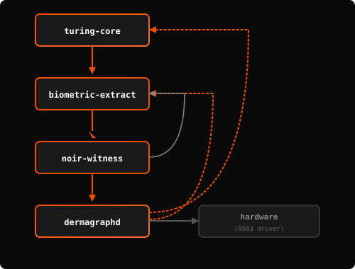

# Dermagraph Architecture

> Technical deep-dive into the cryptographic design and system architecture.

---

## Table of Contents

1. [System Overview](#system-overview)
2. [Cryptographic Primitives](#cryptographic-primitives)
3. [Noir Circuit Design](#noir-circuit-design)
4. [On-Chain Verification](#on-chain-verification)
5. [Data Flow](#data-flow)
6. [Security Analysis](#security-analysis)

---

## System Overview

### Component Architecture


*The diagram above shows the full data flow from fingerprint sensor through ZK proof generation to on-chain verification.*

**Key Components:**
- **R503 Sensor**: 192×192 @ 508 DPI capacitive fingerprint sensor
- **dermagraphd**: Rust daemon handling storage, CNN embedding, Noir witness generation, and X-Lock fuzzy extraction
- **Groth16 Prover**: `nargo execute` + `sunspot prove` running on Raspberry Pi
- **Bridge Server**: Node.js proxy for HTTPS/CORS handling
- **React Frontend**: Privy wallet, SSE events, Solana transaction builder
- **Solana Devnet**: DAO Voting Program with CPI to Sunspot Verifier for Groth16 verification on BN254

### Crate Dependency Graph

<p align="center">
  
</p>

---

## Cryptographic Primitives

### 1. Field Arithmetic (BN254)

All cryptographic operations use the BN254 scalar field for Noir/Solana compatibility:

```
p = 21888242871839275222246405745257275088548364400416034343698204186575808495617
```

**Why BN254?**
- Native to Noir's Barretenberg backend
- Efficient pairing operations for Groth16
- Supported by Solana's compute budget

### 2. Poseidon Hash

Domain-separated Poseidon for all hashing:

```rust
// Constants
PERSON_NULLIFIER_DOMAIN = 0x706572736f6e3a6e756c6c696669657200  // "person:nullifier"
PERSON_COMMITMENT_DOMAIN = 0x706572736f6e3a636f6d6d69746d656e74 // "person:commitment"

// Commitment (Pedersen-style with Poseidon)
commitment = Poseidon(COMMITMENT_DOMAIN, compress(embedding), blinding)

// Nullifier (scope-bound)
nullifier = Poseidon(NULLIFIER_DOMAIN, compress(embedding), scope)
```

### 3. Embedding Compression

128-dimensional float embeddings → 32 field elements:

```rust
fn compress_embedding(values: [Field; 32]) -> Field {
    // Iterative Poseidon compression (chunks of 4)
    let mut acc = values[0];
    for i in 1..32 {
        acc = poseidon([acc, values[i]]);
    }
    acc
}
```

### 4. Sparse Merkle Tree

Identity registry with 2²⁰ capacity (~1M identities):

```rust
pub struct MerkleTree {
    leaves: HashMap<usize, Fr>,  // Sparse storage
    next_index: usize,
    defaults: Vec<Fr>,           // Precomputed empty subtrees
}

// Proof structure
pub struct MerkleProof {
    path: Vec<Fr>,       // 20 siblings
    indices: Vec<bool>,  // Direction bits
    root: Fr,
    leaf: Fr,
}
```

---

## Noir Circuit Design

### person_identity Circuit

**Location:** `circuits/person_identity/src/main.nr`

```noir
// Public inputs (verified on-chain)
struct PublicInputs {
    commitment: Field,    // Binding to embedding
    merkle_root: Field,   // Identity registry root
    scope: Field,         // Application context (e.g., "dao:proposal:0")
    nullifier: Field,     // Anti-sybil token
}

// Private witnesses (never revealed)
struct PrivateWitness {
    embedding: [Field; 32],          // Quantized biometric
    blinding: Field,                  // Commitment randomness
    merkle_proof: MerkleProof,        // Membership proof
}

fn main(
    embedding: [Field; 32],
    blinding: Field,
    merkle_path: [Field; 20],
    merkle_indices: [u1; 20],
    commitment: pub Field,
    merkle_root: pub Field,
    scope: pub Field,
    nullifier: pub Field
) {
    // ══════════════════════════════════════════════════════════════════
    // STEP 1: Verify commitment opens to embedding
    // ══════════════════════════════════════════════════════════════════
    let computed_commitment = compute_commitment(embedding, blinding);
    assert(computed_commitment == commitment);

    // ══════════════════════════════════════════════════════════════════
    // STEP 2: Verify commitment is in Merkle tree
    // ══════════════════════════════════════════════════════════════════
    let computed_root = compute_merkle_root(
        commitment,
        merkle_path,
        merkle_indices
    );
    assert(computed_root == merkle_root);

    // ══════════════════════════════════════════════════════════════════
    // STEP 3: Verify nullifier derivation
    // ══════════════════════════════════════════════════════════════════
    let computed_nullifier = derive_nullifier(embedding, scope);
    assert(computed_nullifier == nullifier);
}
```

### Circuit Constraints

| Component | Constraints |
|-----------|-------------|
| Embedding compression | ~6,400 |
| Commitment verification | ~1,200 |
| Merkle proof (depth 20) | ~24,000 |
| Nullifier derivation | ~2,100 |
| **Total** | **~33,700** |

### Proof Generation Pipeline

```
                    ┌─────────────────┐
                    │  Prover.toml    │
                    │  (witness)      │
                    └────────┬────────┘
                             │
                             ▼
┌─────────────────┐  ┌─────────────────┐  ┌─────────────────┐
│  nargo compile  │──│  nargo execute  │──│  sunspot prove  │
│  (circuit.json) │  │  (witness.gz)   │  │  (proof.bin)    │
└─────────────────┘  └─────────────────┘  └─────────────────┘
                                                   │
                                                   ▼
                                          ┌─────────────────┐
                                          │  324-byte       │
                                          │  Groth16 proof  │
                                          └─────────────────┘
```

---

## On-Chain Verification

### DAO Voting Program

**Program ID:** `CN5wNB5qChhKyxaFJBW7WmBvqm2b9THCGDYZnUfB3DA2`

```rust
pub fn cast_vote_with_proof(
    ctx: Context<CastVoteWithProof>,
    proof: Vec<u8>,           // 324 bytes
    nullifier: [u8; 32],
    commitment: [u8; 32],
    scope: [u8; 32],
    vote_choice: VoteChoice,
) -> Result<()> {
    // ══════════════════════════════════════════════════════════════════
    // 1. Check proposal is active
    // ══════════════════════════════════════════════════════════════════
    require!(proposal.status == Active, ProposalNotActive);

    // ══════════════════════════════════════════════════════════════════
    // 2. Verify ZK proof via CPI to Sunspot
    // ══════════════════════════════════════════════════════════════════
    verify_groth16_proof(&proof, &nullifier, &commitment, &dao.merkle_root, &scope)?;

    // ══════════════════════════════════════════════════════════════════
    // 3. Create nullifier PDA (fails if already exists = double vote)
    // ══════════════════════════════════════════════════════════════════
    // Handled by Anchor's `init` constraint on nullifier_account

    // ══════════════════════════════════════════════════════════════════
    // 4. Record vote
    // ══════════════════════════════════════════════════════════════════
    match vote_choice {
        Yes => proposal.yes_votes += 1,
        No => proposal.no_votes += 1,
        Abstain => proposal.abstain_votes += 1,
    }

    Ok(())
}
```

### Public Witness Format

The Sunspot verifier expects this exact format:

```
┌────────────────────────────────────────────────────────────────────┐
│                      PUBLIC WITNESS (140 bytes)                    │
├──────────────┬──────────────┬──────────────────────────────────────┤
│  Offset      │  Size        │  Field                               │
├──────────────┼──────────────┼──────────────────────────────────────┤
│  0           │  4 bytes     │  nr_inputs (big-endian) = 0x00000004 │
│  4           │  8 bytes     │  reserved (zeros)                    │
│  12          │  32 bytes    │  commitment                          │
│  44          │  32 bytes    │  merkle_root                         │
│  76          │  32 bytes    │  scope                               │
│  108         │  32 bytes    │  nullifier                           │
└──────────────┴──────────────┴──────────────────────────────────────┘
```

### CPI to Sunspot Verifier

```rust
fn verify_groth16_proof(
    proof: &[u8],
    nullifier: &[u8; 32],
    commitment: &[u8; 32],
    merkle_root: &[u8; 32],
    scope: &[u8; 32],
) -> Result<()> {
    // Construct public witness
    let mut public_witness = Vec::with_capacity(140);
    public_witness.extend_from_slice(&4u32.to_be_bytes()); // nr_inputs
    public_witness.extend_from_slice(&[0u8; 8]);           // reserved
    public_witness.extend_from_slice(commitment);
    public_witness.extend_from_slice(merkle_root);
    public_witness.extend_from_slice(scope);
    public_witness.extend_from_slice(nullifier);

    // CPI to verifier
    let instruction_data = [proof, &public_witness].concat();
    invoke(&Instruction {
        program_id: SUNSPOT_VERIFIER_ID,
        accounts: vec![],
        data: instruction_data,
    }, &[])?;

    Ok(())
}
```

---

## Data Flow

### Enrollment Flow

```
┌──────────────────────────────────────────────────────────────────────────┐
│                           ENROLLMENT (ONE-TIME)                          │
└──────────────────────────────────────────────────────────────────────────┘

Step 1: Capture 3 Fingers
──────────────────────────
    User places thumb → capture → "lift finger"
    User places index → capture → "lift finger"
    User places middle → capture → "done"

Step 2: Generate Embeddings
───────────────────────────
    For each finger:
        image (192×192) → CNN → embedding (128-dim)

    Average embeddings → representative embedding

Step 3: X-Lock Enrollment
─────────────────────────
    XLock::enroll([thumb, index, middle])
        → helper_data (public, no secret leakage)
        → β (shared entropy across fingers)
        → embedding_key = HKDF(β, "embedding-encryption")
        → nullifier = HKDF(β, "identity")

Step 4: Compute Commitment
──────────────────────────
    blinding = random_field()
    commitment = Poseidon(DOMAIN, compress(embedding), blinding)

Step 5: Register in Merkle Tree
───────────────────────────────
    tree.insert(commitment) → leaf_index
    merkle_root = tree.root()

Step 6: Store Encrypted
───────────────────────
    ~/.local/share/dermagraphd/
        ├── xlock.bin           # Helper data (not encrypted)
        ├── embedding.enc       # Encrypted with embedding_key
        ├── merkle_tree.bin     # Serialized tree
        └── commitment.bin      # commitment + blinding

Step 7: Update On-Chain
───────────────────────
    DAO.update_merkle_root(merkle_root)
```

### Voting Flow

```
┌──────────────────────────────────────────────────────────────────────────┐
│                         VOTING (PER-TRANSACTION)                         │
└──────────────────────────────────────────────────────────────────────────┘

Step 1: User Clicks "Vote Yes" on Proposal #0
──────────────────────────────────────────────
    Frontend: scope = "dao:proposal:0"

Step 2: Verify Fingerprint (X-Lock)
───────────────────────────────────
    POST /verify-finger {scope: "dao:proposal:0"}

    R503 captures fresh scan
    XLock::verify(fresh_scan, helper_data)
        → matched_finger = "index"
        → nullifier = 0x8fd2f7ab...
        → embedding_key recovered

Step 3: Load Representative Embedding
─────────────────────────────────────
    embedding = decrypt(embedding.enc, embedding_key)

Step 4: Generate Noir Witness
─────────────────────────────
    POST /prove-person {scope: "dao:proposal:0"}

    Load stored: commitment, blinding, merkle_tree
    Generate Prover.toml:
        embedding = [0x1a85..., 0x0490..., ...]
        blinding = 0x081ed938...
        merkle_path = [0x..., ...]
        merkle_indices = [0, 1, 0, ...]
        commitment = 0x22c2d898...
        merkle_root = 0x04493830...
        scope = 0x0064616f3a70726f706f73616c3a30...
        nullifier = 0x1352d91f...

Step 5: Generate Groth16 Proof
──────────────────────────────
    nargo execute → witness.gz
    sunspot prove → proof.bin (324 bytes)

Step 6: Submit to Solana
────────────────────────
    Frontend builds transaction:
        ComputeBudgetProgram.setComputeUnitLimit(1_400_000)
        DaoVoting.cast_vote_with_proof(
            proof, nullifier, commitment, scope, vote=Yes
        )

    User signs with Privy wallet
    Transaction submitted to devnet

Step 7: On-Chain Verification
─────────────────────────────
    DAO Voting Program:
        1. CPI to Sunspot verifier
        2. Sunspot: "Proof verified successfully!"
        3. Create nullifier PDA (prevents re-use)
        4. Increment proposal.yes_votes

Step 8: Success
───────────────
    TX: 38FPt6dgJahb7qtPGd4H7SNLo1qa3cEZ...
    Vote recorded!
```

---

## Security Analysis

### Threat Model

| Threat | Mitigation |
|--------|------------|
| **Stolen device** | Biometric required—can't use without finger |
| **Biometric database breach** | No database—data never leaves device |
| **Replay attack** | Nullifier recorded on-chain; can't reuse |
| **10-finger sybil** | Cross-finger CNN → same person = same nullifier |
| **Fake finger (gummy)** | Capacitive sensor + liveness detection |
| **Man-in-the-middle** | ZK proof binds to on-chain state |
| **Malicious merkle_root** | Stored on-chain; daemon uses trusted state |

### Cryptographic Security

| Property | Hardness Assumption | Level |
|----------|---------------------|-------|
| Commitment hiding | Discrete log on BN254 | 128-bit |
| Commitment binding | Poseidon collision | 128-bit |
| Nullifier uniqueness | Poseidon preimage | 128-bit |
| Proof soundness | Groth16 knowledge | 128-bit |
| Merkle membership | Poseidon collision | 128-bit |

### Privacy Guarantees

1. **Biometric Privacy**: The embedding is a private witness in the ZK proof. The verifier learns nothing about the biometric.

2. **Unlinkability**: Different scopes produce different nullifiers. Voting on Proposal 0 cannot be linked to voting on Proposal 1.

3. **Anonymity Set**: All registered identities share the same merkle_root. Proof reveals "I'm one of N registered users" but not which one.

### Known Limitations

1. **Single-device binding**: Identity is tied to the device with stored commitment. Multi-device requires re-enrollment.

2. **Merkle root updates**: Each new enrollment requires updating on-chain merkle_root (admin operation).

3. **Liveness**: Capacitive sensing provides basic liveness but isn't foolproof against sophisticated attacks.

---

## Performance Metrics

| Operation | Time | Hardware |
|-----------|------|----------|
| Fingerprint capture | ~1s | R503 sensor |
| CNN embedding | ~0.5s | Raspberry Pi 4 |
| X-Lock verify | ~50ms | Pi 4 |
| Noir witness gen | ~100ms | Pi 4 |
| nargo execute | ~1.8s | Pi 4 |
| sunspot prove | ~2.1s | Pi 4 |
| **Total proof gen** | **~4s** | **Pi 4** |
| Solana TX confirm | ~0.5s | Devnet |
| On-chain verify | 188k CU | - |

---

## Future Improvements

1. **Recursive proofs**: Batch multiple identity proofs into one verification
2. **Compressed accounts**: Use Light Protocol for cheaper nullifier storage
3. **Threshold signing**: Multi-party computation for shared identity
4. **Mobile integration**: iOS/Android sensor support
5. **Decentralized registry**: Replace admin merkle_root updates with permissionless enrollment
