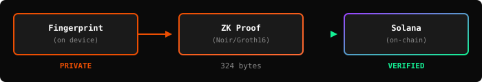
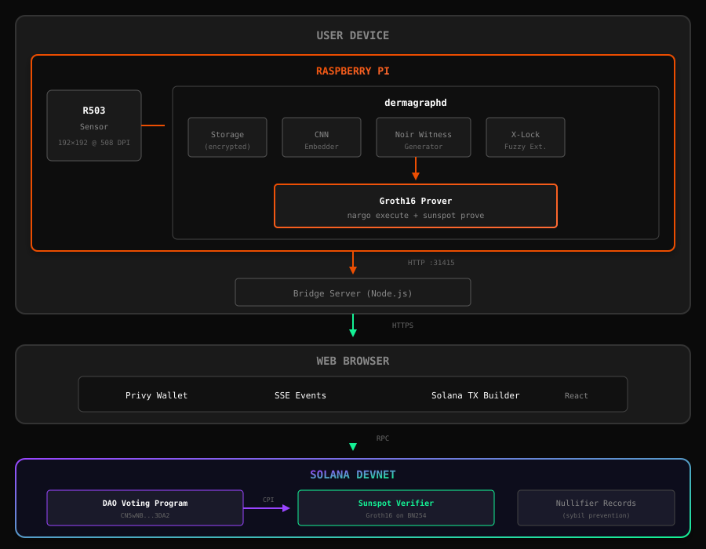

# Dermagraph

**Privacy-Preserving Biometric Identity for Solana**

> Your fingerprint becomes your cryptographic identity—without ever leaving your device.

[](https://solana.com)
[](https://noir-lang.org)
[](LICENSE)

---

## What is Dermagraph?

Dermagraph is a **biometric identity layer** that enables sybil-resistant, privacy-preserving authentication on Solana. It uses **zero-knowledge proofs** (Noir/Groth16) to prove you're a unique human without revealing your biometric data.

### The Problem

| Traditional Auth | Dermagraph |
|-----------------|------------|
| Wallets can be created infinitely | One identity per unique human |
| Airdrops farmed by bots | Sybil-resistant token distribution |
| DAO votes can be bought | One-person-one-vote governance |
| Biometrics stored in databases | Biometric never leaves your device |

### The Solution

<p align="center">
  
</p>

Your fingerprint generates a **deterministic nullifier** through zero-knowledge cryptography. The same person always produces the same nullifier for a given context—but different contexts are unlinkable.

---

## Key Features

### Privacy-First Design
- Biometric data **never leaves your device**
- ZK proofs reveal nothing about your fingerprint
- Unlinkable across different applications

### Sybil Resistance
- **One identity per unique human**
- Cross-finger detection prevents 10-finger attacks
- Deterministic nullifiers prevent double-voting

### On-Chain Verification
- Groth16 proofs verified on Solana (~215k compute units)
- Works with any Solana program via CPI
- Sunspot verifier for Noir circuits

### Real Hardware
- R503 capacitive fingerprint sensor
- Runs on Raspberry Pi 4
- Production-ready daemon with encrypted storage

---

## Architecture Overview

<p align="center">
  
</p>

See [ARCHITECTURE.md](./ARCHITECTURE.md) for detailed technical documentation.

---

## Demo: DAO Voting with Biometric Verification

https://x.com/stcisgood/status/2018140868868293118

**What you're seeing:**
1. User scans fingerprint on R503 sensor
2. Daemon generates Noir witness + Groth16 proof
3. Proof submitted to Solana with vote
4. Sunspot verifier confirms on-chain
5. Vote recorded with nullifier (prevents double-voting)

**Transaction Example:**
[View on Solana Explorer →](https://explorer.solana.com/tx/38FPt6dgJahb7qtPGd4H7SNLo1qa3cEZMVKHVf4wQfHA4vF5q6eBYHdrH6BRyptR6PcERYxqcSTW34EoCz4szks3?cluster=devnet)

---

## Technical Highlights

### Noir ZK Circuit: `person_identity`

```noir
fn main(
    // Private (never revealed)
    embedding: [Field; 32],      // Quantized biometric
    blinding: Field,             // Commitment randomness
    merkle_proof: MerkleProof,   // Membership proof

    // Public (verified on-chain)
    commitment: pub Field,       // Pedersen commitment
    merkle_root: pub Field,      // Registered identities
    scope: pub Field,            // Application context
    nullifier: pub Field         // Sybil-resistance token
) {
    // 1. Verify commitment opens correctly
    assert(poseidon([DOMAIN, compress(embedding), blinding]) == commitment);

    // 2. Verify membership in identity tree
    assert(merkle_proof.verify(commitment, merkle_root));

    // 3. Verify nullifier derivation
    assert(poseidon([NULLIFIER_DOMAIN, compress(embedding), scope]) == nullifier);
}
```

**Circuit Stats:**
- Constraints: 33,700
- Proof generation: ~2.1 seconds (Raspberry Pi 4)
- Proof size: 324 bytes (Groth16)
- On-chain verification: ~188k compute units

### Cross-Finger Sybil Resistance

Traditional biometrics: Each finger = separate identity = 10 sybil accounts per person.

**Dermagraph solution:** We trained a ResNet18-based contrastive learning model that produces similar embeddings for all fingers of the same person.

```
Thumb  ──┐
Index  ──┼──▶ CNN ──▶ [0.42, -0.31, ...] ──▶ Same Nullifier
Middle ──┘     ↑                             (for same scope)
               │
         InfoNCE loss
         128-dim embeddings
         ~94% cross-finger TAR
```

Based on [Columbia University research](https://www.science.org/doi/10.1126/sciadv.adi0329) (Science Advances 2024). See [ARCHITECTURE.md](./ARCHITECTURE.md) for technical details.

### X-Lock Fuzzy Extractor

Handles biometric noise (sweat, dust, angle variations) without leaking helper data:

```rust
// Enrollment: Store helper data for 3 fingers
let helper = XLock::enroll(&[thumb, index, middle])?;
storage.store_xlock(&helper).await?;

// Verification: Any enrolled finger works
let (matched, nullifier) = XLock::verify(&fresh_scan, &helper)?;
// matched = "index finger", nullifier = 0x8fd2f7ab...
```

---

## What's Included

```
dermagraph/
├── crates/
│   ├── turing-core/        # Cryptographic primitive (Poseidon, field ops)
│   ├── biometric-extract/  # Fingerprint feature extraction
│   ├── noir-witness/       # ZK witness generation
│   ├── dermagraphd/        # Background daemon (runs on Pi)
│   └── hardware/           # R503 sensor driver
├── circuits/
│   └── person_identity/    # Noir ZK circuit
├── solana/
│   └── programs/
│       └── dao-voting/     # On-chain voting program
├── web-app/                # React frontend
└── bridge-server/          # Node.js proxy
```

---

## Quick Start

### Prerequisites

```bash
# Rust
curl --proto '=https' --tlsv1.2 -sSf https://sh.rustup.rs | sh

# Node.js 18+
# https://nodejs.org/

# Solana CLI
sh -c "$(curl -sSfL https://release.solana.com/stable/install)"

# Noir (nargo)
curl -L https://raw.githubusercontent.com/noir-lang/noirup/main/install | bash
noirup

# Sunspot (Groth16 prover for Solana)
cargo install sunspot-cli
```

### 1. Clone & Download Model Weights

```bash
git clone https://github.com/STCisGOOD/dermagraph.git
cd dermagraph

# Download pre-trained CNN weights from release (~45MB)
mkdir -p crates/biometric-extract/checkpoints
curl -L -o crates/biometric-extract/checkpoints/best_burn.safetensors \
  https://github.com/STCisGOOD/dermagraph/releases/download/v1.0.0/best_burn.safetensors
```

### 2. Configure Environment

```bash
# Set up web app environment
cd web-app
cp .env.example .env.local

# Edit .env.local:
# - Get a Privy App ID from https://dashboard.privy.io
# - Set VITE_DAEMON_URL=http://localhost:31415 for local dev
# - Set VITE_USE_REAL_SOLANA=false for mock mode (no SOL needed)
```

### 3. Build

```bash
cd ..  # back to repo root

# Build Rust crates
cargo build --release

# Build Noir circuit
cd circuits/person_identity && nargo compile && cd ../..

# Install frontend deps
cd web-app && npm install && cd ..

# Install bridge server deps
cd bridge-server && npm install && cd ..
```

### 4. Run the Demo (Mock Sensor)

```bash
# Terminal 1: Daemon with mock sensor
cargo run --release -p dermagraphd -- --sensor mock

# Terminal 2: Bridge server
cd bridge-server && npm start

# Terminal 3: Frontend
cd web-app && npm run dev
```

Open http://localhost:5173 and connect your wallet!

> **Note:** Mock mode simulates fingerprint scans. For real hardware setup with Raspberry Pi + R503 sensor, see [JOURNEY.md](./JOURNEY.md).

---

## Hardware Setup

**Minimum Hardware (~$60):**
- R503 Capacitive Fingerprint Sensor (~$18)
- Raspberry Pi 4 (~$35)
- MicroSD card (~$8)
- Jumper wires (~$3)

**Wiring:**
```
R503          Raspberry Pi
────          ────────────
VCC (Red)  →  3.3V (Pin 1)
GND (Black)→  GND (Pin 6)
TX (Yellow)→  GPIO15/RX (Pin 10)
RX (Green) →  GPIO14/TX (Pin 8)
```


---

## Hackathon Tracks

### Aztec: ZK with Noir

**Best Non-Financial Use Case**

Dermagraph uses Noir for privacy-preserving biometric authentication:
- `person_identity` circuit proves identity without revealing biometrics
- Groth16 proofs verified on Solana via Sunspot
- Novel: Fingerprint-derived nullifiers for sybil resistance

### Open Track: Privacy on Solana

**Supported by Light Protocol & Solana Foundation**

Dermagraph brings hardware-backed privacy to Solana:
- Real fingerprint sensor integration (not simulated)
- On-chain proof verification in a single transaction
- Composable with any Solana program via CPI

---

## Security Properties

| Property | Mechanism |
|----------|-----------|
| **Biometric Privacy** | ZK proofs—embedding never leaves device |
| **Sybil Resistance** | Deterministic nullifiers from biometric |
| **Unlinkability** | Different scope → different nullifier |
| **Non-Transferability** | Requires physical finger + device |
| **Liveness** | Capacitive sensor detects real finger |
| **Double-Vote Prevention** | Nullifier stored on-chain |

---

## API Reference

### Daemon Endpoints

```http
POST /enroll-fingers-stream
Content-Type: application/json

{"scope": "dermagraph:identity:v1"}

# Response: SSE stream with enrollment progress
```

```http
POST /verify-finger
Content-Type: application/json

{"scope": "dao:proposal:0", "passphrase": null}

# Response:
{
  "success": true,
  "data": {
    "verified": true,
    "nullifier": "0x8fd2f7ab...",
    "matched_finger": "index"
  }
}
```

```http
POST /prove-person
Content-Type: application/json

{"scope": "dao:proposal:0"}

# Response:
{
  "success": true,
  "data": {
    "proof": "0x0a1d8388...",
    "nullifier": "0x1352d91f...",
    "merkle_root": "0x04493830...",
    "commitment": "0x2310e8fd..."
  }
}
```

---

## Roadmap

- [x] Core cryptographic primitive (Poseidon-based)
- [x] Noir ZK circuit for person identity
- [x] R503 sensor integration
- [x] On-chain Groth16 verification (Sunspot)
- [x] DAO voting demo
- [ ] Mobile app (iOS/Android)
- [ ] Multi-device sync
- [ ] Decentralized identity registry
- [ ] Integration with Light Protocol compressed accounts

---

## Research Foundation

Dermagraph builds on peer-reviewed research:

1. **Cross-Finger Matching**
   Guo et al. "Unveiling intra-person fingerprint similarity via deep contrastive learning"
   *Science Advances* (2024) — [DOI](https://www.science.org/doi/10.1126/sciadv.adi0329)

2. **Fuzzy Extractors**
   Dodis et al. "Fuzzy Extractors: How to Generate Strong Keys from Biometrics"
   *SIAM Journal on Computing* (2008)

3. **X-Lock Construction**
   Kurbatov et al. "Unforgettable Fuzzy Extractor: Practical Construction and Security Model"
   *IACR ePrint* (2025) — [ePrint 2025/1799](https://eprint.iacr.org/2025/1799)

4. **Poseidon Hash**
   Grassi et al. "Poseidon: A New Hash Function for Zero-Knowledge Proof Systems"
   *USENIX Security* (2021)

---

## Team

Built for the [Solana Privacy Hackathon](https://solana.com/privacyhack#resources) by:

- **[@STCisGOOD](https://github.com/STCisGOOD)** — Building systems that amplify individual expression and cultural evolution.

---

## License

MIT License. See [LICENSE](./LICENSE).

